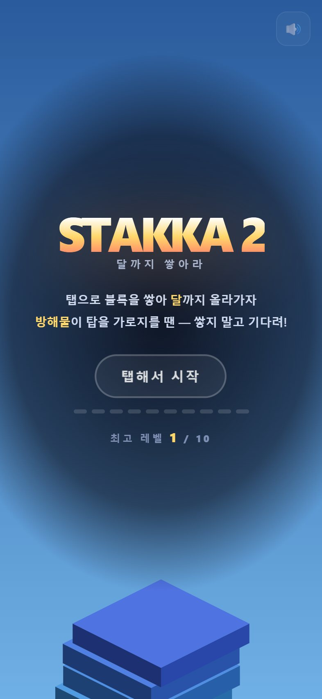
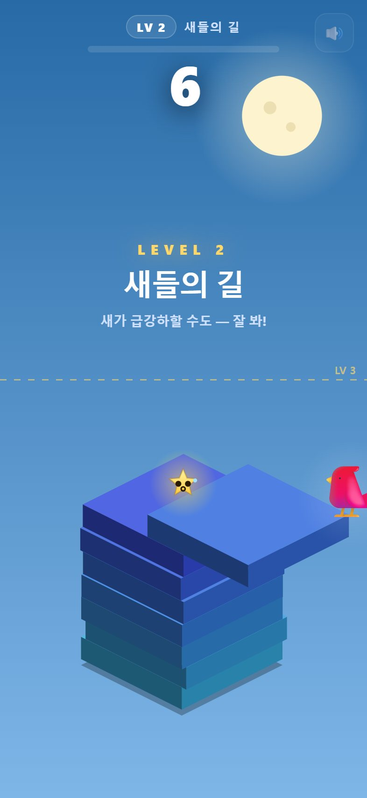
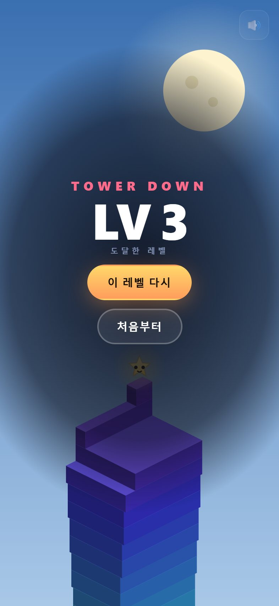

# STAKKA 2 — 달까지 쌓아라

<p align="center">
  <a href="https://midasyoo.github.io/stakka2/">
    
  </a>
</p>

<p align="center">
  <a href="https://midasyoo.github.io/stakka2/"><b>▶︎ 지금 바로 플레이 — midasyoo.github.io/stakka2</b></a>
</p>

<p align="center">
  
  
  
  
  
</p>

---

## 게임 소개

**STAKKA 1** 의 원터치 타워 쌓기를 베이스로, **스토리 모드** 가 더해진 속편이다.

작은 별 ⭐ 이 달 🌙 을 만나러 하늘로 탑을 쌓아 올린다. 하늘에는 10개의 구역이 있고,
구역마다 **방해물** 이 탑 꼭대기를 가로지른다.

> **방해물이 탑 위를 지나갈 때 블록을 쌓으면 맞아서 무너진다.**
> 지나갈 때까지 기다렸다가, 틈에 쌓아야 한다.

쌓기 타이밍과 방해물 회피 타이밍 — **두 겹의 타이밍** 이 얽히며, 원작보다 훨씬 깊어졌다.

- **방해물은 매번 다르게 움직인다** — 같은 새라도 속도·크기·높이·방향이 전부 랜덤.
  파도치듯 흔들리며 나르거나(🐦), 급강하 후 복귀하거나(🐦), 포물선으로 떨어지거나(☄️),
  슬금슬금 다가오다 확 달려들거나(🐱), 제자리에 맴돌기도(👻) 한다. **패턴을 외울 수 없다.**
- 10개 레벨 = 10개의 하늘 구역. 클리어할 때마다 배경·방해물이 바뀐다
- 레벨 클리어마다 **체크포인트 저장** — 죽으면 해당 레벨부터 다시
- 끝까지 올라가면 **달에 도착** 하는 엔딩
- v1의 **PERFECT 회복** 콤보 시스템 그대로 유지

---

## 바로 플레이하기

### 📱 휴대폰

```
https://midasyoo.github.io/stakka2/
```

카카오톡·문자로 링크를 받아 **탭하면 인앱 브라우저에서 바로 실행**.

### 🏠 앱처럼 쓰기 (홈 화면에 추가)

| 기기 | 방법 |
|---|---|
| **아이폰 (Safari)** | 하단 **공유(⬆︎)** → **홈 화면에 추가** |
| **안드로이드 (Chrome)** | 우측 상단 **⋮** → **홈 화면에 추가** |

> 카톡 인앱 브라우저에서는 **Safari로 열기** 먼저.

---

## 게임 방법

### 조작

화면 아무 데나 **탭** (PC: 클릭 / 스페이스바).

### 핵심 규칙

1. 블록이 좌우로 왕복. 탭으로 아래층에 맞춰 쌓는다.
2. 빗나간 만큼 **잘려나간다.**
3. **방해물이 탑 꼭대기를 가로지를 때 쌓으면 → 맞아서 게임오버.** 쌓지 말고 기다려라.
   - 방해물이 덮치는 순간 블록이 **빨간색 + "!"** 로 경고 표시된다.
4. 거의 정확히 맞추면 **PERFECT**. 콤보 2부터 블록이 **다시 커진다** (회복).
5. 각 레벨의 목표 층수(6층)에 도달하면 **다음 구역으로**. 60층(10레벨) = 달 도착.

### 죽으면?

- **체크포인트** 가 켜져 있다 — 현재 레벨의 시작부터 다시.
- "처음부터" 버튼으로 1레벨부터 재시작할 수도 있다.
- 최고 도달 레벨은 자동 저장.

---

## 10개의 하늘 구역

| LV | 구역 | 방해물 | 힌트 |
|---:|---|:---:|---|
| 1 | 동네 지붕 | — | 연습. 편하게 쌓아보자 |
| 2 | 새들의 길 | 🐦 | 흔들리며 나르거나 급강하 — 패턴이 매번 달라 |
| 3 | 구름 바다 | ☁️ | 느린 구름이 예측 불가하게 덮친다 |
| 4 | 연의 축제 | 🪁 | 지그재그·포물선으로 스쳐 간다 |
| 5 | 풍선 마을 | 🎈 | 풍선이 아래서 흔들리며 떠오른다 |
| 6 | 유령의 숲 | 👻 | 반투명 유령이 제멋대로 맴돈다 |
| 7 | 구름 고양이 | 🐱 | 슬금슬금 다가오다 확 달려든다(扑힌다) |
| 8 | 번개 구름 | ⚡ | 경고 후 번개가 치는 순간 피해! |
| 9 | 유성우 | ☄️ | 유성이 여러 발씩 포물선으로 쏟아진다 |
| 10 | 달의 곶 | ☄️ | 마지막 — 유성 폭풍 속 달님이 기다린다 |

---

## 스크린샷

<p float="left">
  
  
  
  
</p>

시작 · 플레이 · 게임오버 · **달 도착 엔딩**

---

## 직접 실행하기

```bash
git clone https://github.com/midasyoo/stakka2.git
# index.html 더블클릭 → 바로 실행 (서버/빌드 불필요)
```

홈 화면 추가(PWA)까지 확인하려면:

```bash
cd stakka2 && python -m http.server 8000
```

---

## 테스트

```bash
node test.js
# → 32 passed, 0 failed
```

검증 항목: 레벨 진행 · 방해물 충돌 판정 · **대기 중 안전**(방해물 없을 때 정상 배치) ·
체크포인트 재생성 오프바이원 · 60층 도달 시 승리 · 승리 후 재시작 · 10레벨 방해물 설정 무결성 · 렌더.

> 테스트가 잡아낸 버그: 체크포인트 재생성 루프가 한 층 짧아 재시작 시 목표보다 낮게 세팅되던 오프바이원.

---

## 파일 구조

```
stakka2/
├── index.html        게임 전체 (HTML+CSS+JS, 단일 파일)
├── test.js           헤드리스 로직 테스트 32개
├── manifest.json     PWA 설정
├── icon-180/192/512  홈 화면 아이콘
├── og.png            링크 미리보기 이미지
└── screenshots/      README용 스크린샷
```

## 기술

- Canvas 2D + 자체 아이소메트릭 투영
- 방해물은 **이모지 렌더링** (에셋 0, 기본 폰트)
- 마스코트(작은 별)는 캔버스 도형으로 실시간 드로잉 — 기분에 따라 표정 변화
- Web Audio 실시간 합성 (레벨업/승리 징글 포함)
- iOS 인앱브라우저·노치·주소창 대응

---

## v1과의 차이

| | STAKKA 1 | STAKKA 2 |
|---|---|---|
| 모드 | 무한 | **10레벨 스토리** |
| 신규 메커닉 | — | **방해물 회피** (쌓기 + 회피 이중 타이밍) |
| 진행 | 최고층 경쟁 | **체크포인트 + 달 도착 엔딩** |
| 캐릭터 | — | **마스코트(별)** + 테마별 하늘 |
| 죽음 | 1회 → 처음부터 | **현재 레벨부터 재시작** |

<p align="center"><a href="https://midasyoo.github.io/stakka2/"><b>달까지 쌓아보기 ▶︎</b></a></p>
